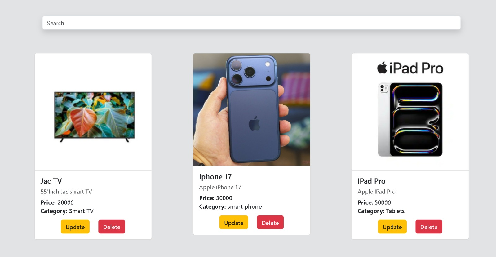

# 📦 Stockify - Inventory Management System (IMS)

**Stockify** is a smart and comprehensive product management platform (CRUD System) built entirely with frontend vanilla web technologies. It allows users to seamlessly Add, Read, Update, and Delete products, featuring advanced functionalities like real-time search, persistent local storage, and intelligent image encoding.

🔗 **Check out the [Live Demo](https://elshamy-24.github.io/Stockify/)!** 🔥
---
### 1. Robust Data Persistence (`LocalStorage` Workflow)
* **State Synchronization:** The application implements an asynchronous-like state pipeline where every mutating operation (`Add`, `Update`, `Delete`) instantly synchronizes the in-memory array with the browser's `LocalStorage`.
* **Zero-Data Loss Refresh:** Built-in fault tolerance using logical short-circuiting (`JSON.parse(...) || []`) ensuring the application bootstraps smoothly with zero runtime errors even on clean, first-time user visits.

### 2. Advanced Live Search & Index-Mapping UX
* **The Search Index Bug Solved:** In standard CRUD apps, filtering a list breaks array indexing, causing actions on a filtered list to delete or update the wrong item in the main database. Stockify solves this by dynamically mapping filtered UI components back to their absolute master array positions using a strict `.indexOf()` lookup pipeline.
* **Synchronized State Views:** When a product is deleted or modified during an active search, the view state instantly recalculates and re-filters the UI on-the-fly, providing an intuitive, continuous user experience without breaking the user's flow.

## ✨ Key Features

* **Full CRUD Operations:** Effortlessly add new products, browse them in structured Bootstrap cards, update their details, or delete them entirely.
* **Image Base64 Handling:** Converts uploaded product images instantly into a `Base64 String` to store them directly inside the client's browser.
* **Smart Update Flow:** Retains the product's original image if the user only updates textual details (like price or title), and overrides it instantly when a new image is provided, preventing any data mismatches.
* **Real-time Search & Filter:** Searches products by name on-the-fly. It intelligently references the real database index using `indexOf` to prevent updating or deleting the wrong product while a search filter is active.
* **Responsive Clean UI:** A sleek, fully responsive interface designed with **Bootstrap 5**. Card heights dynamically adjust (`h-auto`) based on the text length using precise Flexbox alignment to eliminate dead white space.
* **Persistent Storage:** Backed by `LocalStorage` to guarantee that all product records persist across browser refreshes and sessions.
* **Stateful Form Control:** Automatically manages view toggles between "Add" and "Save Changes" states, resetting form fields cleanly upon event execution.
---
## Application Screenshot 📸

## 🛠️ Tech Stack

* **HTML5** - Structured document layout and validated input forms.
* **CSS3 & Bootstrap 5** - Modern styling, layout grids, and flexbox utilities for consistent spacing.
* **JavaScript (ES6+)** - Core application logic, DOM manipulation, FileReader API, and LocalStorage synchronization.

---
## 🚀 What's Next?

> "Because for me, I don't just stop when a project works." 💡

### Next Step :
**Connect with a Real Database🔥** 🔄

*Loading more features...* ⏳
